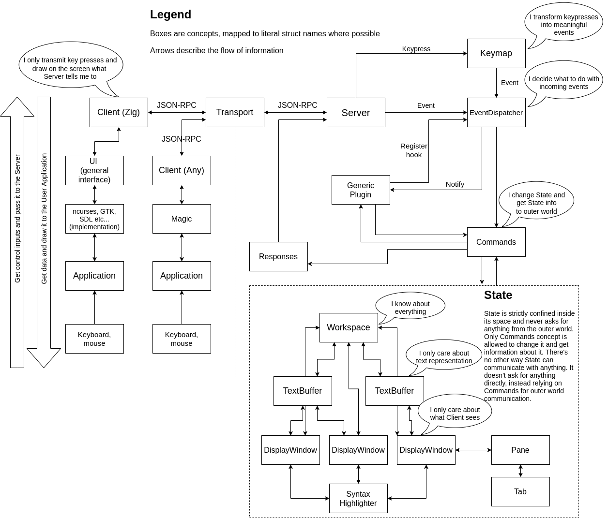

# Kisa

Kisa is a hackable batteries-included code editor.

Kisa is in its early stage and it is not usable at the moment.

Further are design ideas and philosophy behind this editor.

## Purpose

I, greenfork, the one who started this project, would like to have a
supreme code editor. I want to edit code with pleasure, I want to know
that whenever I feel something is not right - I have enough power to fix it,
but with great power comes great responsibility. I shall wield this power
with caution and I shall encourage my peers and empower them to follow
my steps and eventually let them lead me instead of simply being led.

## Zen

* Programmer must be able to perfect their tool.
* Choice is a burden.

## Requirements

### Must-haves

Following features should make the editor usable.

* Modal editing, convenient key bindings
* File finder, project-wide grepping, in-file searching
* Syntax highlighting

### Nice-to-haves

Features not used by everyone but which provide more pleasant experience.

* Language Server Protocol (LSP)
* Multiple cursors
* Jump inside file to functions, variables etc.
* Multiple panes/tabs
* Swapable frontends, client-server architecture
* Mouse integration
* Autocompletion
* Clipboard integration

### Out of scope

All of it would be nice, but let's grow steadily.

* Non-UTF8 encodings
* Edit binaries/hexeditor
* Edit large files like gigabytes of csv

## Why?

My personal frustration with other editors is that I only seem to have a very
limited ability to hack on them. With [Emacs] although I do enjoy writing Lisp
code, the Emacs-Lisp never sat right with me, it's Lisp-2 and I'm more of a
Schemer, so maybe this is the reason. With [Kakoune] I don't want to deal
neither with C++ to edit the source code, nor with Bash to write scripting
extensions. Writing a non-trivial extension in a language of choice is
something I'm afraid to look at, writing something from scratch seems as
a better option than spending hours on learning the code to understand
the limitations and get disappointed, though there's also a happy scenario.

## Hackable

I believe there are several key points to make an editor hackable:

* Interesting design
* Clean code
* Eternal polishing

And some points to make it hackable for everyone who is not me:

* Extensive documentation
* Preaching about it in blog posts, on streams, at conventions
* Friendly attitude to anyone interested in hacking

## Configuration

There are several possible levels of varying configurability:

1. No configuration at all
2. Configuration of builtin options with true/false, numbers and strings
3. Provide "hooks" to execute commands when certain events are fired
4. Expose editor API via an embedded language like Lua

Let's forget about the first option, I don't want to be the only user of
this editor even if I write it for myself.

Second option looks like a good start, there's [editorconfig] format which we
can gladly use. It is also possible to merge it with other options but I
have a feeling that these should be separate things in separate places.
One small "hook" in custom editorconfig format and we will be against all
the demons of the underworld trying to add just one more.

[editorconfig]: https://editorconfig.org/

Third option, the concept of a "hook" as a general idea of an executable piece
of code which will be run after a certain event was fired like inserting a character or
switching panes. This is a nice approach but the problem I see here is that
we will need a language that is going to be executed in this "hook" and we
can't really leave it as a choice to the user. Let's read my sad story
about [Kakoune]:

Kakoune is an example with minimal own language for configuration, main idea is
to use integrations written in any language the user wants to, and the Kakoune
language just enables easier interoperation. The result is
that most of the scripts are written in Bash (: And the more complicated ones
use a myriad of languages such as Guile, Perl, Python, Crystal, Rust. Although
it is feasible to use them, the most common denominator is Bash and this is sad.

Fourth option, the API. The holy grail of programming. I program my editor, I am
in the command. But am I really? I will still be able to program things which
the editor carefully exposed to me via its API. And once I want to do something
more significant, I will have to do it in another language, Zig, with different
set of abstractions and everything. The main idea of embedding a scripting
language is that it is easy to hop in but it always fails whenever the user
desires a more sophisticated ability to extend the code. At this point the
complexity of an extension language can be comparable to the source language.

As a side note there are some languages I considered as an embedded
extension language:
* [Lua]
* [Squirrel]
* [Wren]
* [PocketLang]
* [Chibi Scheme]
* [Guile]
* [mruby]
* [bog]

[Lua]: https://www.lua.org/
[Wren]: https://wren.io/
[PocketLang]: https://github.com/ThakeeNathees/pocketlang
[Chibi Scheme]: https://github.com/ashinn/chibi-scheme
[Guile]: https://www.gnu.org/software/guile/
[Squirrel]: http://squirrel-lang.org/
[mruby]: http://mruby.org/
[bog]: https://github.com/Vexu/bog

For now my heart is closer to plain config file and modifying the source if
we need something extra.

## Extension points and plugins

Configuration with a full API exposure can be considered as a plugin/script
extension. My idea is that we should have these things separate for a
number of reasons:
1. For large programs it could be very important to run asynchronously, so
   that a slow Ruby program would not freeze your editor while it tries to
   lint the code.
2. Large programs are more likely to invest into more sophisticated transport
   such as JSON-RPC via pipes or whatever we have. Thus we will not be subjected
   to implementing an "easy to use" interface via our config files.

Asynchrony traditionally adds a lot of complexity to the application. We will
explore whether we are able to solve this problem in our specific case and
not in general by providing a limited set of API endpoints to plugins. Otherwise
we might find ourselves solving the problem of simultaneous edits by
multiple users.

For additional notes see [xi article on plugins].

[xi article on plugins]: https://xi-editor.io/docs/plugin.html

## Highlighting

There are numerous ways to do highlighting. In this case I would like to
explore the possibility of treating highlighted tokens not only as a colored
thingy on the screen, but also as a semantic token. This is useful e.g. for
jumping through functions in the file. Both highlighting and semantic
information seem to be tightly coupled so we have an ability to provide a
default semantic information with our highlighter as well as leverage
3rd-party programs such as Language Server Protocol (LSP) to provide us this
information with better precision.

Further are some examples how editors do highlighting.

### Kakoune

[Kakoune] uses regex with slight modifications to allow code reuse and nested structures.
Looks almost good enough: usually it is hard to edit and some rare constructs
seem hard to implement (I couldn't implement highlighting for [slim], but
maybe I'm not that smart).

[slim]: https://github.com/slim-template/slim

### amp

[amp] reuses Textmate syntax highlighting configurations. The config files look
as a mix of regex and some kind of pushdown automata. Extremely interesting
option but needs more research.

### vis

[vis] it has direct integration with Lua and uses Parsing Grammar Expressions (PEG)
in combination with the Lua language features. Looks very neat and powerful.

### Emacs

[Emacs] it doesn't have anything in particular, just uses some regex together with
the power of Emacs-Lisp language. The editor is the Lisp machine, it doesn't
really need anything special.

### joe

[joe] uses a full-blown description of a state machine that parses the text with
simplified grammar rules. Quite large files, for example C grammar takes
300 loc, Ruby grammar takes 600 loc (Ruby has complicated grammar). Although
the grammar is correct (e.g. Kakoune grammar is not 100% correct), it takes
some dedication to create such a grammar file.

## Implementation details

### Terminal display and input library

Editors written in other than C languages such as Go ([micro], [qedit])
or Rust ([helix], [amp]) use their own library which implements terminal
display routines. C/C++ based editors largely use [ncurses] library
([kakoune], [vis], [neovim]). Since this editor's language of choice is Zig,
there are 2 choices: port ncurses library and write our own. I tried to
[port the ncurses library] but eventually gave up because of infinite confusion
with it. The code is also quite and quite hard to understand, there's an
[attempt to make it better] but it is sadly not packaged at least in Arch Linux
distribution which could be a problem. I decided that we should implement
the library that is going to provide just the necessary for us features.

Terminal input story is similar, other than C languages implement their own
libraries which seems necessary for them anyway. The
C land has [libtermkey] which is contrary to ncurses has pretty good source code,
it is used at least by [neovim] and [vis]. But the state of this library is
a little bit questionable, end-of-life was declared for it at least since
2016 and the original author advertises their new [libtickit] library which
tries to be an alternative library to ncurses but it didn't get wide adoption.
Libtermkey is alive as a [neovim fork] however so this could be a viable option
nonetheless. But again, implementing this library seems rather straightforward
as demonstrated by [kakoune] and there are some new ideas about the
full and proper representation of keypresses, see [keyboard terminal extension]
by the kitty terminal.

We will do everything in Zig. Hooray.

[ncurses]: https://en.wikipedia.org/wiki/Ncurses
[libtermkey]: http://www.leonerd.org.uk/code/libtermkey/
[port the ncurses library]: https://github.com/greenfork/zig-ncurses
[libtickit]: http://www.leonerd.org.uk/code/libtickit/
[neovim fork]: https://github.com/neovim/libtermkey
[keyboard terminal extension]: https://sw.kovidgoyal.net/kitty/keyboard-protocol.html
[attempt to make it better]: https://github.com/sabotage-linux/netbsd-curses

### Where is it going to run?

Since the initial implementation is going to be a terminal-based client, we
will strive for the highest common denominator of all terminals, some popular
choices:

* [Foot]
* [Alacritty]
* [Kitty]
* [Urxvt]
* [iTerm2]
* [tmux]
* [xterm]... oops sorry, [this is the one]
* [cygwin]?

[Foot]: https://codeberg.org/dnkl/foot
[Alacritty]: https://github.com/alacritty/alacritty
[Kitty]: https://sw.kovidgoyal.net/kitty/
[Urxvt]: https://wiki.archlinux.org/title/Rxvt-unicode
[iTerm2]: https://iterm2.com/
[tmux]: https://github.com/tmux/tmux
[xterm]: https://github.com/xtermjs/xterm.js/
[this is the one]: https://invisible-island.net/xterm/
[cygwin]: https://www.cygwin.com/

### Architecture

This structure is not complete, there are still some unknowns. Some
considerations:

- Do we want to organize specific modules like Autocompletion and LSP as
  plugins utilizing direct communication with the server via JSON-RPC?
  This will reduce the capabilities to which they can interact with the
  system but it will provide useful insight on the design of a plugin system.

#### Why client-server architecture?

Short answer: because it's fun, more opportunities, and it doesn't promise
to be too overwhelming. Longer answer:

* Frontends must only speak JSON, they can be written in any language.
* Commandline tools can interact with a running editor session with ease.
* Switching to client-server architecture later is almost equal to a complete
  rewrite of the system, so why not just do it from the start.

Also see:
* [neovim-remote]
* [foot server daemon mode]

[neovim-remote]: https://github.com/mhinz/neovim-remote
[foot server daemon mode]: https://codeberg.org/dnkl/foot#server-daemon-mode

[Kakoune]: https://github.com/mawww/kakoune
[amp]: https://github.com/jmacdonald/amp
[vis]: https://github.com/martanne/vis
[micro]: https://github.com/zyedidia/micro
[vy]: https://github.com/vyapp/vy
[neovim]: https://github.com/neovim/neovim
[helix]: https://github.com/helix-editor/helix
[xi]: https://xi-editor.io/
[qedit]: https://github.com/fivemoreminix/qedit
[kilo]: https://github.com/antirez/kilo
[moe]: https://github.com/fox0430/moe
[paravim]: https://github.com/paranim/paravim
[focus]: https://github.com/jamii/focus
[Emacs]: https://www.gnu.org/software/emacs/
[joe]: https://joe-editor.sourceforge.io/

## Is this a task for a mere mortal?

Code editor is a big project. I have a habit of abandoning projects, I moderately
lose interest to them. I am not religious but God give me strength.

In the interview on [Zig Showtime] Andreas Kling, the author of [SerenityOS],
talks about how important it is to lay just one brick at a time. Let's try that.

[Zig Showtime]: https://www.youtube.com/watch?v=e_hCJI__q_4
[SerenityOS]: https://github.com/SerenityOS/serenity
