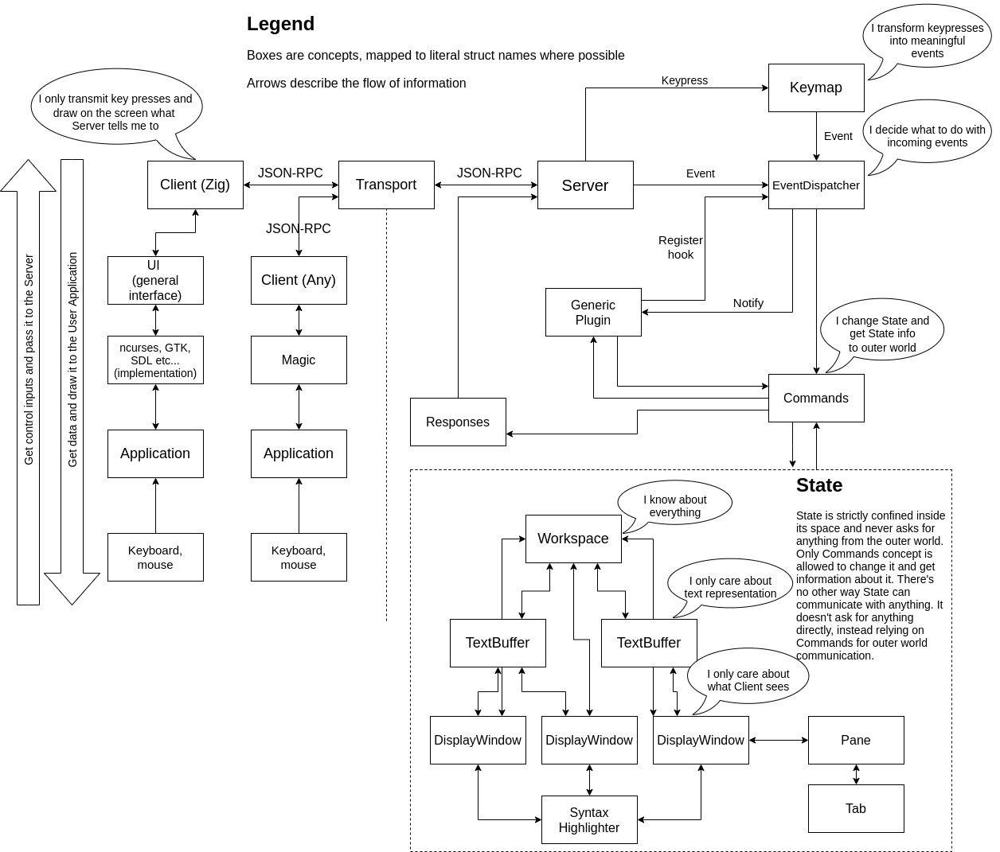

# Server architecture design

## Architecture

This section is volatile and may change frequently.



Examples of a Generic Plugin:
- Language Server Protocol
- Autocompletion
- Pair autoinsertion
- Jumping inside a file

### Why client-server architecture?

Short answer: because it's fun, more opportunities, and it doesn't promise
to be too overwhelming. Longer answer:

* Frontends must only speak JSON, they can be written in any language.
* Commandline tools can interact with a running editor session with ease.
* Switching to client-server architecture later is almost equal to a complete
  rewrite of the system, so why not just do it from the start.

Also see:
* [neovim-remote]
* [foot server daemon mode]

[neovim-remote]: https://github.com/mhinz/neovim-remote
[foot server daemon mode]: https://codeberg.org/dnkl/foot#server-daemon-mode

## Request-Respond loop

Server is implemented as a traditional while true loop. It listens on a Unix
domain socket and waits for client connections. Once the client is connected,
the server initializes some state for this client and keeps its socket,
listening for both incoming clients and message from the new client. Every
client has a consistent connection to the server and it only interrupts when the
client session ends.

Server speaks JSON-RPC 2.0 protocol but it does not solely act as a "Server",
meaning that it does not _only_ accepts requests, it can also initiate
requests to the client, such as "the current file being edited has changed"
if program change the file. So the server expects the client to also listen
for any requests. In this sense both client and server both send and respond to
requests.

Every request from the client is resolved asynchronously.
```
Client requests -->
Client waits
<-- Server responds
Client receives the response and continues
```

In theory this should be fast enough and in worst case there could be a
visible lag. Unfortunately we will only experience the lag when we
implement it. And at that point we will be too deep into the design so
we will have to either optimize everything out of its guts which may
increase the complexity exponentially, or reimplement everything from
scratch, resuing some existing code and decisions. I really hope we
won't have to go this route.

Every request from the server is resolved in 3 phases, with the first one
being a non-blocking request to the client, and then the client does its
usual synchronous request.
```
Server requests, non-blocking ->
Client receives, does not respond
Client requests -->
Client waits
<-- Server responds
Client receives the response and continues
```

The idea is that in order to send something in a non-blocking way, that
something must be all fit into `SO_SNDBUF` which is OS-dependent. On my
machine for Unix domain sockets it is 208KB which is very enough but we
probably shouldn't rely on this fact. So the idea is to send something
small to the client, so the the client can ask for that something.
This is how we do non-blocking send.

Now, why do we need non-blocking send? This is to avoid deadlocks. On the
server we always expect some requests from clients and if we end up in a
situation when the server and the client simultaneously send their request,
we have a deadlock where both are waiting for a response from both sides
at the same time. The non-blocking send resolves this situation since at
no point in time we block on the call to `send` in user space.

## Event-based system

Event-based system is a mechanism for integration with internal and
external plugins, generally with everything that is not in the "core" of
the editor. The editor core emits events at the strategic points of
execution and the editor allows to "hook up" into these events and do
different actions based on event types and any metadata they carry.
